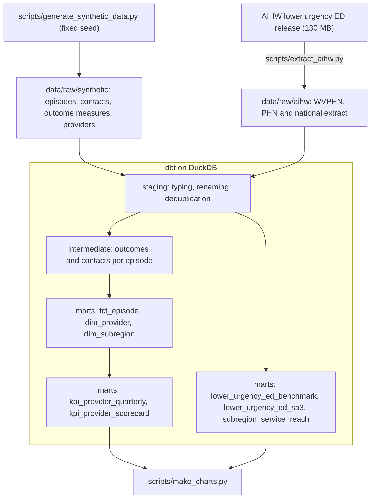
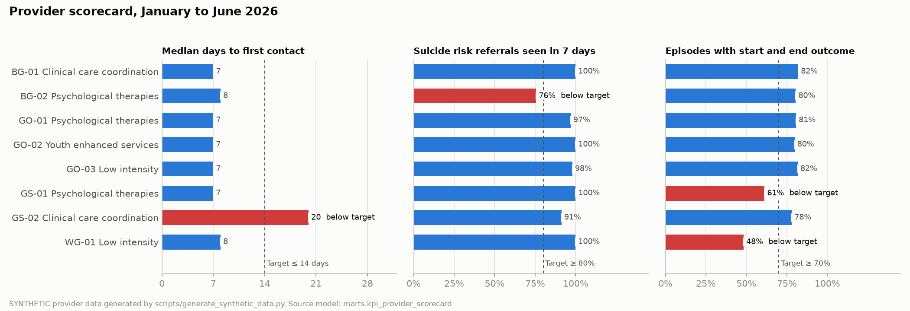
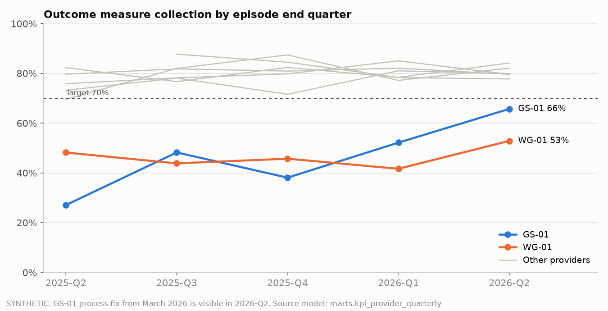
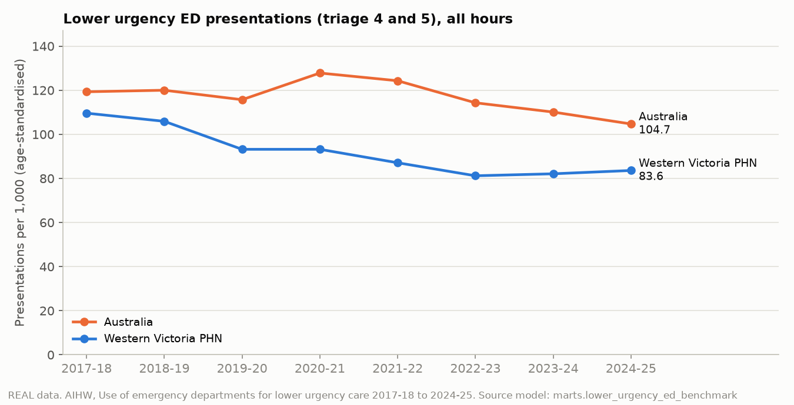
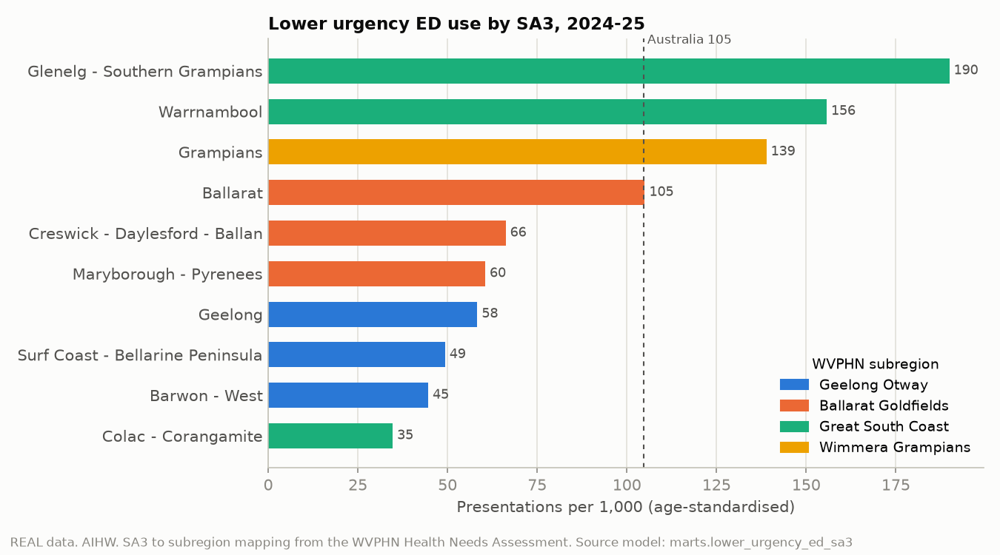

# Western Victoria PHN: Mental Health Service Performance Analytics

[](https://github.com/anson4747/wvphn-mental-health-analytics/actions/workflows/ci.yml)


An analytics engineering project for a Primary Health Network (PHN): commissioned mental health
service data and public emergency department data are modelled in **dbt on DuckDB** into a tested
star schema and a provider KPI layer that flags which providers need attention and why.

> **Real and synthetic data are kept separate and labelled throughout.**
> Provider, client and service records are **synthetic**, shaped on the national Primary Mental
> Health Care Minimum Data Set (PMHC MDS), because that data is confidential. Population figures,
> the SA3 to subregion mapping and all emergency department data are **real** (AIHW and the
> WVPHN Health Needs Assessment).

## Highlights

* **Seeded, reproducible synthetic data:** a generator with behaviour profiles per provider, re-run in CI and diffed against the committed files
* **Layered dbt project:** sources, staging, intermediate and marts, 17 models and 59 data tests
* **Data quality tests that catch real defects:** the one-contact-per-day test found 2,648 duplicate contact days in the first version of the generator
* **Real public data, cleaned properly:** a 130 MB AIHW release cut to 0.5 MB, re-encoded, deduplicated across worksheets and benchmarked against all 31 PHNs
* **KPI logic in one place:** thresholds are dbt variables and every chart is rendered from a tested mart

## Architecture



## What the KPI layer finds

### Provider scorecard, January to June 2026 (synthetic)



Four providers were generated with known problems. The KPI layer flags each of them, and only them:

| Provider | Built-in issue | Flagged by |
|---|---|---|
| GS-02 | Long waits to first contact | Median wait 20 days against a 14 day target |
| BG-02 | 7 day follow up of suicide risk referrals drops from January 2026 | 76% against an 80% target |
| WG-01 | Outcome measures not collected at episode end, poor closure | 48% paired outcome collection against 70% |
| GS-01 | Same as WG-01, process fixed from March 2026 | 61% for the half year, recovering to 66% in 2026-Q2 |



WG-01 and GS-01 also hold most of the **stale open episodes** (status Open, first contact more than
180 days before the extract): 261 and 291, against 40 to 95 for every other provider. In practice
that is the first thing to clean up, because stale episodes also depress the outcome collection rate.

### Lower urgency emergency department use (real AIHW data)



* Western Victoria's age-standardised rate of lower urgency (triage 4 and 5) ED presentations has been
  **below the national rate every year since 2017-18**.
* The gap to national has **narrowed for three years running**, from 37 per 1,000 in 2021-22 to 21 in
  2024-25: the national rate fell from 124 to 105 while the regional rate stayed between 81 and 87.



* Inside the PHN the spread is large: **Glenelg - Southern Grampians (190 per 1,000) is more than five
  times Colac - Corangamite (35)**, and Glenelg - Southern Grampians, Warrnambool and Grampians all sit
  well above the national rate of 105.
* **Caveat:** AIHW flags 9 of the 10 SA3s because results only include formal public EDs, which affects
  comparability for regional areas. Treat the SA3 ranking as a prompt for local investigation (GP
  availability, after-hours access, urgent care options), not as a like-for-like comparison.

## KPI definitions

| KPI | Definition | Target |
|---|---|---|
| Median days to first contact | Median of referral date to first service contact, episodes referred in the period | ≤ 14 days (illustrative) |
| 7 day follow up | Suicide risk referrals with first contact within 7 days ÷ suicide risk referrals with a first contact | ≥ 80% (illustrative) |
| Outcome collection (Out-3 style) | Completed episodes with an outcome measure at both start and end ÷ completed episodes | ≥ 70% |
| Stale open episode | Status Open and first contact more than 180 days before the extract date | Count to clear |

Targets live in [`dbt/dbt_project.yml`](dbt/dbt_project.yml) as variables. More detail, including the
grain of every model, is in [docs/data-model.md](docs/data-model.md).

## Data quality

The tests are not decorative. Run against the first version of the generator, the build failed:

```
FAIL 2648 assert_one_contact_per_episode_day
```

The generator sampled contact days with replacement. That and a second defect (SDQ scores clipped at a
floor of 10 when the scale runs 0 to 40) were fixed at source. The full log of checks and what each one
protects is in [docs/data-quality.md](docs/data-quality.md).

## Repository layout

```
data/raw/synthetic/        generated PMHC MDS style files (committed so the project runs without the generator)
data/raw/aihw/             AIHW extract and the publisher's readme
dbt/models/staging/        one model per source table: typing, renaming, deduplication
dbt/models/intermediate/   episode level rollups of outcomes and contacts
dbt/models/marts/          star schema, KPI marts and ED benchmarking
dbt/tests/                 singular data quality tests
scripts/                   synthetic data generator, AIHW extract, chart rendering
docs/                      data model, data quality log, chart images
```

## Run it

Requires Python 3.11 or later.

```bash
pip install -r requirements.txt

# optional: regenerate the synthetic data (identical output every run)
python scripts/generate_synthetic_data.py --out data/raw/synthetic

# build every model and run every test
cd dbt
dbt build --profiles-dir .
cd ..

# render the charts from the marts
python scripts/make_charts.py --db dbt/wvphn.duckdb --out docs/images
```

To rebuild the AIHW extract from the full release, download the CSV from the
[AIHW report](https://www.aihw.gov.au/reports/primary-health-care/use-of-emergency-departments-lower-urgency-care/contents/about)
and run `python scripts/extract_aihw.py --src <path to csv>`.

## Data sources

| Data | Status | Source |
|---|---|---|
| Lower urgency ED presentations 2017-18 to 2024-25 | Real | Australian Institute of Health and Welfare (aihw-phc-23) |
| Subregion population (2023 ERP) | Real | WVPHN Health Needs Assessment, 2026 update |
| SA3 to subregion mapping | Real | WVPHN Health Needs Assessment, Table 2 |
| Episodes, service contacts, outcome measures, providers | **Synthetic** | `scripts/generate_synthetic_data.py`, structured on the PMHC MDS specification |

Provider codes are de-identified on purpose (for example `GS-01`) so no real organisation is implied.

## Author

**Anson Sebastian**, Melbourne
