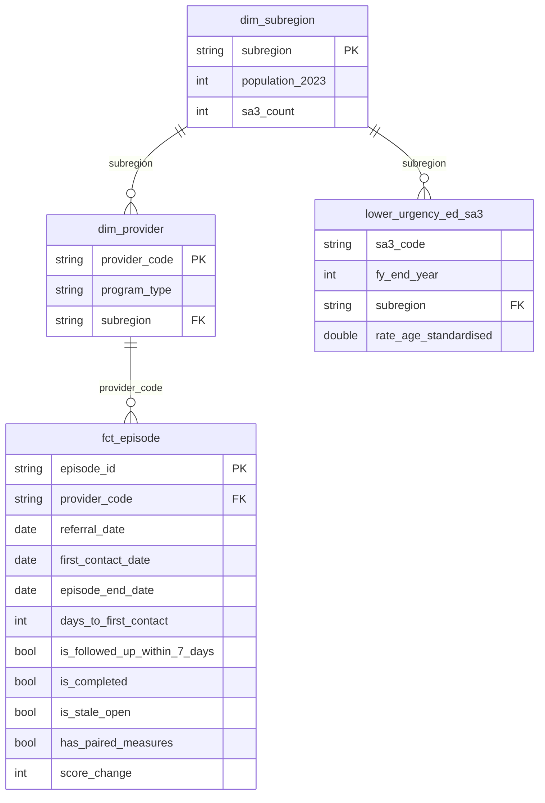

# Data model

## Layers

| Layer | Materialisation | Purpose |
|---|---|---|
| `staging` | view | One model per source table. Cast types, rename to snake_case, normalise codes, deduplicate. No business logic. |
| `intermediate` | view | Episode level rollups that more than one mart needs. |
| `marts` | table | Star schema and KPI tables that charts and dashboards read. |

## Models

| Model | Grain | Notes |
|---|---|---|
| `stg_pmhc__providers` | provider | Synthetic, de-identified codes |
| `stg_pmhc__subregions` | subregion | Real 2023 population |
| `stg_pmhc__sa3_subregion_map` | SA3 | Real mapping, used to join AIHW data |
| `stg_pmhc__episodes` | episode | Dates typed, suicide risk flag as boolean |
| `stg_pmhc__service_contacts` | service contact | Attended flag as boolean |
| `stg_pmhc__outcome_measures` | outcome collection | Occasion normalised to `start` / `end` |
| `stg_aihw__lower_urgency_ed` | geography, year, triage, hour band, measure | Deduplicated; PHN groups separated from PHNs |
| `int_episode_outcomes` | episode | Start and end scores side by side |
| `int_episode_contacts` | episode | Contacts booked and attended, minutes, last contact |
| `dim_provider` | provider | With subregion and region |
| `dim_subregion` | subregion | With SA3 count and names |
| `fct_episode` | episode | Every flag the KPIs need: wait, 7 day follow up, completion, stale, paired outcomes |
| `kpi_provider_quarterly` | provider, quarter | Access KPIs by referral quarter; outcome collection by end quarter |
| `kpi_provider_scorecard` | provider | January to June 2026 with status against targets |
| `lower_urgency_ed_benchmark` | financial year | Western Victoria PHN against Australia, PHN median and rank of 31 |
| `lower_urgency_ed_sa3` | SA3, financial year | Rates, counts and population for the ten WVPHN SA3s |
| `subregion_service_reach` | subregion | Synthetic referrals per 1,000 alongside real ED use |

## Design decisions

**KPIs aggregate one fact table.** Every flag a KPI needs is computed once in `fct_episode`, so the
KPI marts are simple filtered counts. A definition changes in one place.

**Each KPI uses the date that defines its cohort.** Wait time and follow up belong to the quarter the
referral arrived; outcome collection belongs to the quarter the episode ended. Mixing them would
compare different groups of clients in the same row.

**Targets are dbt variables.** `target_outcome_collection_rate`, `target_7day_followup_rate` and
`target_median_wait_days` sit in `dbt_project.yml`, so a target change is a one line edit and is
visible in version control.

**Real and synthetic data never blend silently.** `data_source` is carried on synthetic tables and
every mart that mixes the two says so in its description and in chart footnotes.

**Lower scores are better.** K10+ and SDQ both measure distress or difficulty, so a negative
`score_change` is an improvement.

## Entity relationships

